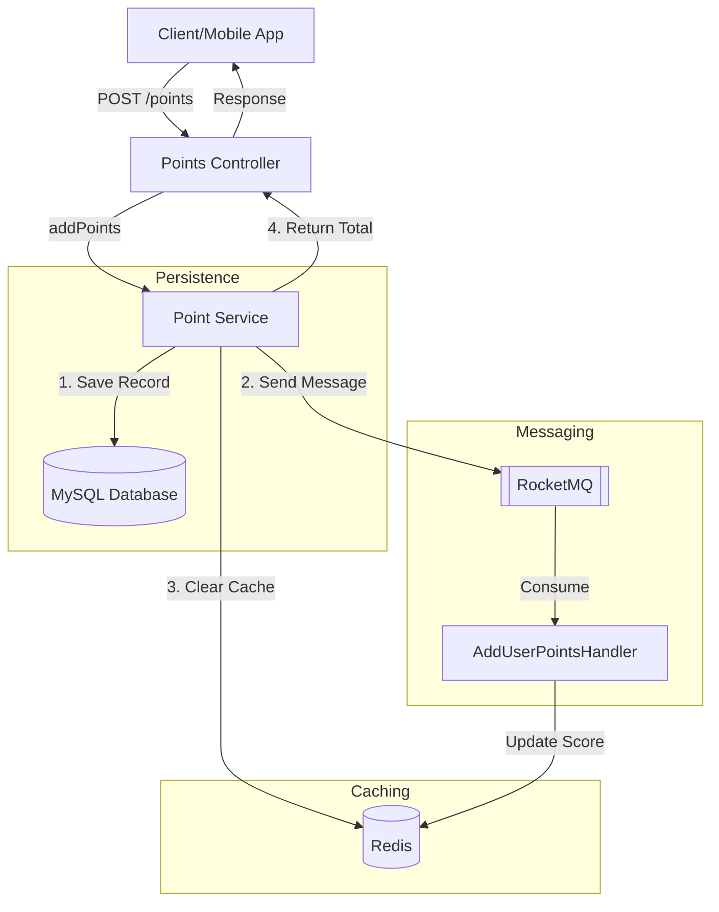

# Point Management System (Homework Backend)

A Spring Boot-based backend service for managing user points with high-performance leaderboard support using Redis and asynchronous processing via RocketMQ.

## 🚀 Key Features
- **Point Management**: Add, update, and get user points.
- **Leaderboard**: Real-time top-N user leaderboard powered by Redis ZSet.
- **Asynchronous Processing**: Point events are sent to RocketMQ for downstream consumption.
- **Warm-up Cache**: Automatic leaderboard population on application startup.

---

## 🛠 Technical Decisions

### 1. Hard Delete vs. Soft Delete
For this project, we have implemented **Hard Delete** (removing records permanently from the database).
- **Reasoning**: Chosen for simplicity and speed of development during the prototyping phase.
- **Production Perspective**: In a real-world production environment, **Soft Delete** (e.g., using a `is_deleted` flag) is often preferred to:
    - Maintain data audit trails.
    - Recover accidentally deleted data.
    - Preserving referential integrity for historical reporting.
- **Decision Factor**: The choice between hard and soft delete ultimately depends on specific product requirements and compliance standards (e.g., GDPR "Right to be Forgotten" might favor hard deletes or anonymization).

### 2. Leaderboard Caching Strategy
The system uses a **Full Cache Warm-up** strategy for the leaderboard on startup.
- **Implementation**: On application launch, the `PointService` scans the database and populates the Redis Sorted Set (`ZSet`).
- **Why Full Cache?**: 
    - **Data Consistency**: If we used a "Lazy Loading" or "Partial Cache" strategy, deleting a user currently on the leaderboard would leave a "hole" that cannot be filled accurately from the cache alone.
    - **Accuracy**: Ensuring the `ZSet` contains all user totals ensures that the Top-N query is always 100% accurate without falling back to expensive SQL `SUM` and `ORDER BY` operations during high-traffic requests.

---

## 📊 Data Flow Diagram (DFD)

The following diagram illustrates how a point addition request flows through the system:



---

## 🧪 Testing
The project includes a comprehensive test suite covering different layers:
- **Unit Tests**: Mocked dependencies for fast execution.
- **Integration Tests**: Uses an **H2 In-Memory Database** and **Embedded Redis** to ensure tests run without external dependencies.

Run tests with:
```bash
./mvnw test
```

---

## ⚙️ Configuration
The application requires several environment variables to run in production (see `src/main/resources/application.yaml`):
- `MYSQL_HOST`, `MYSQL_USER`, `MYSQL_PASSWORD`
- `REDIS_HOST`, `REDIS_PORT`
- `ROCKETMQ_NAMESRV_ADDR`

For local development, you can use the provided `docker-compose.yaml` (if available) or override these in a local profile.
